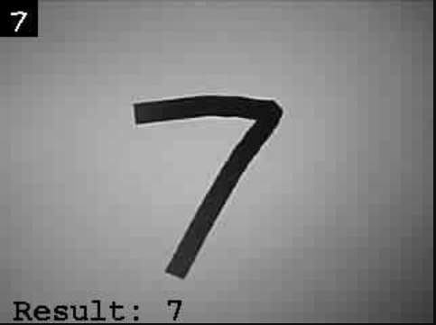

# A simple demo of ESP_TF
## Demo

## Supported boards
The default board for this example is the
`Seeed XIAO ESP32S3 Sense`

To change the board edit
[platformio.ini](./platformio.ini)

An config for the `esp32cam` (non ESP32S3) is provided in platformio.ini

Most ESP32 boards should work but do not pass S3 build flags to non S3 boards.


## Tensorflow model performance 

The included model takes :


| Layer implementation | Time to Invoke (milliseconds) |
| -------------- | ----------------------------- |
| tensorflow micro example implementations of layers | 1390 |
| ESP_NN (ansi c implementations) | 217 |
| ESP_NN (espressif s3 specific implementations) | 21 |
### Model
```
model = tf.keras.models.Sequential([
  tf.keras.layers.InputLayer(input_shape=(28*28)),
  tf.keras.layers.Reshape((28,28,1)),
  tf.keras.layers.Conv2D(32, kernel_size=(3, 3), activation="relu"),
  tf.keras.layers.MaxPooling2D(pool_size=(2, 2)),
  tf.keras.layers.Conv2D(64, kernel_size=(3, 3), activation="relu"),
  tf.keras.layers.MaxPooling2D(pool_size=(2, 2)),
  tf.keras.layers.Flatten(),
  tf.keras.layers.Dropout(0.5),
  tf.keras.layers.Dense(10, activation="softmax"),
])
```
### Performance note
Capturing the jpeg image converting it to raw pixels and then converting back to a jpeg image consumes a significant amount of time.
The demo is using esp32s3 and model inference takes around 20ms. However as is shown in the video the stream is only going at a few frames per second.

## Input image format
The model in this example is trained on the original mnist dataset. These images are highly processed and look very different from image captured from the camera. 

This example manually formats images to look like mnist images. The result of this formatting is show in the top left of the mjpeg stream and it what is passed to the tensorflow model.


To format images captured from the camera assumptions are made and as a result of those assumption this demo only works when pointed at single numbers on white backgrounds. 

### More info about how mnist images 
[The MNIST Database of Handwritten Digits](http://yann.lecun.com/exdb/mnist/)

> "The original black and white (bilevel) images from NIST were size normalized to fit in a 20x20 pixel box while preserving their aspect ratio. The resulting images contain grey levels as a result of the anti-aliasing technique used by the normalization algorithm. The images were centered in a 28x28 image by computing the center of mass of the pixels, and translating the image so as to position this point at the center of the 28x28 field."
## Training your own model
[See ESP_TF_demo.ipynb](./ESP_TF_demo.ipynb)
